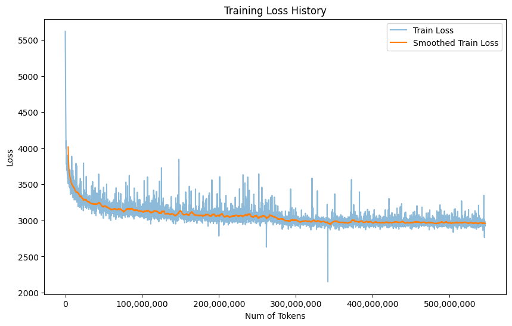

# LlaMA2-30M
## Description
This project is a personal desire to replicate and understand the LLaMA2 architecture, incorporating some modifications to enhance learning and experimentation with language models. Specifically, it integrates xformers' Memory-efficient Multi-Head Attention and an Accurate GELU Activation function. (KV caching was excluded from Attention mechanism to manage memory usage, though this feature can be reinstated for inference.)

**Model Size** : 30 million parameters

**Dataset Size**: pre-trained on a corpus of 500 million tokens. 

## Project Intent and Outcomes
The primary objective of this project was educational, focusing on the pre-training process of language models. It's important to note that the model's performance is not benchmark competitive. The training process showed progressive reduction in loss, underscoring the learning curve rather than achieving state-of-the-art results. This limitation arises from the dataset's volume; a robust model is likely to be obtained after at least training on 5-10 billion tokens, a resource scale beyond this project's scope.
### Training Loss Visualization

Below is a graph of the training loss over time:



The blue line represents the actual loss at each batch, while the orange line shows the smoothed training loss, providing a clearer view of the overall trend. As can be seen in the graph, the loss decreases significantly at the beginning of training and then stabilizes, indicating that the model is learning effectively from the training data. Minor fluctuations in the actual loss are normal and reflect the variance in different batches of data.

## Installation

Follow these steps to set up your environment and run the project.

### Prerequisites

- Python 3.10 or higher
- pip (Python package installer)

#### It's recommended to set up a virtual environment.

### Installing Dependencies

Install the required packages using `pip`:

```bash
pip install -r requirements.txt
```

## Usage

To generate text based on prompts with a specified maximum number of tokens, use the following command:

```bash
python3 inference.py <prompts> [--max_tokens <number>]
```

- `<prompts>`: One or more prompts for text generation. Enclose each prompt in quotes if it contains spaces.
- `--max_tokens <number>`: Optional. The maximum number of tokens to generate. Defaults to 64 if not specified.

### Example

```bash
python3 inference.py "Tell me a story about space." "Describe your ideal vacation." --max_tokens 150
```

This will generate text for each of the given prompts with up to 150 tokens per prompt.

## Training the Model

This section provides instructions on how to train the model using the provided `train.py` script.

Ensure that you have saved tokenized dataset in the pytorch format (.pt).

### Training

To start training the model, run the `train.py` script from the project root directory:
A
```bash
python3 train.py
```

The script will automatically:

- Load the dataset and tokenizer.
- Initialize the model and optimizer.
- Start the training loop, printing loss information and saving model checkpoints periodically.

### Model Checkpoints

During training, the model checkpoints will be saved in the `/model/trained/mini_llama` directory. Each checkpoint includes:

- Model state dictionary.
- Optimizer state dictionary.
- Training loss history.

The script also manages checkpoint files by deleting the previous one each time a new checkpoint is saved to conserve disk space.

## Data Preprocessing for Custom Training Data

If you're interested in training the model on your own dataset, you can use the provided data preprocessing script to prepare your data. This script cleans and tokenizes the text data, making it suitable for training.

### Preprocessing Steps

1. **Cleaning**: It performs basic cleaning of the text, such as removing excessive newlines and quotes, and ensures that spaces are normalized.
2. **Filtering**: Optionally filters out chunks containing specific tokens that might not be desirable for training.
3. **Chunking**: Breaks the text into chunks of a specified maximum length, preparing it for efficient training.
4. **Tokenization**: The script uses SentencePiece for tokenization, which breaks down your text into tokens understandable by the model.

### Customization

You can customize the preprocessing by adjusting the script's parameters, such as `max_length` for chunk size or modifying the cleaning and filtering steps to suit your dataset's needs.
You can use different dataset by changing this piece in data_preprocessing.py:
```python
dataset_path = "AlisherAmirbek/LlaMA2-30M-dataset"

shard_files = [
    f"{dataset_path}/data-00000-of-00080.arrow",
    f"{dataset_path}/data-00001-of-00080.arrow",
    f"{dataset_path}/data-00002-of-00080.arrow",
    f"{dataset_path}/data-00003-of-00080.arrow",
    f"{dataset_path}/data-00004-of-00080.arrow",
    f"{dataset_path}/data-00005-of-00080.arrow",
    f"{dataset_path}/data-00006-of-00080.arrow",
]

dataset = load_dataset('arrow', data_files=shard_files)
```
### Output
The script saves the preprocessed and tokenized dataset in a PyTorch-compatible format, making it straightforward to load for training.
```bash
python preprocess_data.py --max_length 513 --dataset_path "path/to/your/dataset" --tokenizer_path "path/to/your/tokenizer.model" --output_path "path/to/save/dataset_tokenized.pth"
```

